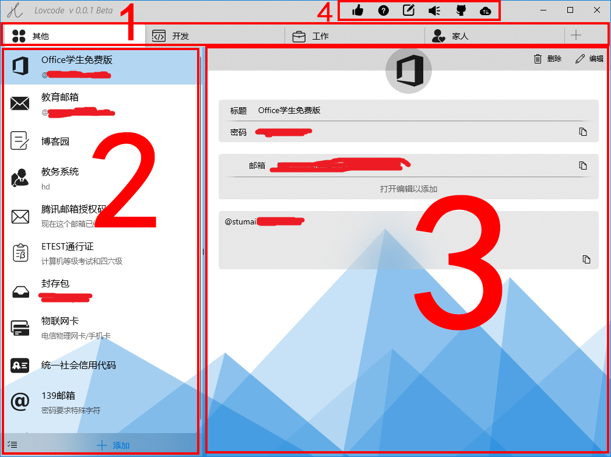
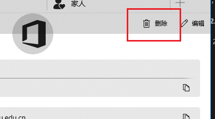

## 整体

主页面如下图所示


主页面主要由以下四部分组成



1. 文件夹列表
2. 密码列表
3. 密码内容，编辑和查看复用同一部分
4. 菜单

这四部分都在 View 文件夹中。

## 各部分的逻辑关系

4 和 123 没什么联系，主要是 123 直接的逻辑。我使用了 MVVMLight 的 Messenger，使各部分处于弱连接状态。下面说几条主要逻辑关系。

### 选中文件夹

选中某个文件夹时，会发出消息

```
Messenger.Default.Send(
  index < FolderItems.Count ? FolderItems[index] : null
  , "FolderSelected"); // index是选中的0基文件夹序号
```

2 和 3 同时注册 Messenger，以监听文件夹选择

```
Messenger.Default.Register<FolderItem>(this, "FolderSelected", FolderSelected);
```

因此选中文件夹时，能够触发以下操作：

1. 在 3 中，会记录选择的文件夹 ID，用于编辑或新建密码。
2. 在 2 中，会根据选中的文件夹，查询该文件夹下的密码，并展现在列表中。

### 选中密码

如果选中密码列表中的一个密码，会发出消息

```
Messenger.Default.Send(passwordItem, "PasswordSelectedChanged");
```

这个`"PasswordSelectedChanged"`消息已被 3 注册，3 接收到后会展现密码详情。
<br>
其实在选中文件夹时，2 也会发送这个消息，但`passwordItem`是空值，3 接收到空消息会清空当前显示，从而实现选中文件夹即清空密码详情部分。

### 保存密码

添加或编辑密码，保存成功后会发出消息

```
Messenger.Default.Send(newPassword, "PasswordAddOrEdited");
```

在 2 中注册了这个消息，收到这个消息会在列表中添加一条记录，此时接收到的密码，已经成功保存在数据库中，因此只需在界面展现即可。

### 密码列表操作密码

在 2 中做以下操作，会生成添加密码的消息通知

- 点下方“添加”
- 点右键菜单的“添加”

  

```
Messenger.Default.Send<object>(null, "AddNewPassword");
```

3 会保存正在编辑的，保存成功后新建一条空内容。

### 密码详情页删除密码

在 3 中删除密码，会生成消息通知

```
Messenger.Default.Send(password.Id, "PasswordDeleted");
```



2 接收到后删除列表中对应的密码

## 文件夹

文件夹使用了`TabView`，重写`TabItemTemplate`

```
        <muxc:TabView Style="{StaticResource TabViewStyle}"
                      Grid.Row="1"
                      MinHeight="40"
                      VerticalAlignment="Top"
                      CanDragTabs="True"
                      TabDragCompleted="{x:Bind Model.DragCompleted}"
                      TabItemsSource="{x:Bind Model.FolderItems}"
                      SelectedIndex="{x:Bind Model.SelectedIndex,Mode=TwoWay}"
                      AddTabButtonClick="{x:Bind Model.HandleAddFolder}">
            <muxc:TabView.TabItemTemplate>
                <DataTemplate>
                    <muxc:TabViewItem Header="{Binding Name}"
                                      IsClosable="False"
                                      Height="40">
                        <muxc:TabViewItem.Template>
                            <ControlTemplate TargetType="muxc:TabViewItem">
                                <!--
                                ...
                                -->
                            </ControlTemplate>
                        </muxc:TabViewItem.Template>
                    </muxc:TabViewItem>
                </DataTemplate>
            </muxc:TabView.TabItemTemplate>
        </muxc:TabView>
```

## 密码列表

密码列表是`ListView` + `Microsoft.Toolkit.Uwp.UI.Controls`中的`Expander`，`Expander`是下方添加、批量编辑。

```
    <Grid>
        <Grid.RowDefinitions>
            <RowDefinition Height="*"/>
            <RowDefinition Height="auto"/>
        </Grid.RowDefinitions>

        <ListView>
        </ListView>
        <controls:Expander Grid.Row="1">
        </controls:Expander>
    </Grid>
```

## 密码详情

这部分就是控件的堆叠，包含大量 View 与 ViewModel 的绑定。键值对部分是`ListView`，具体查看相关代码
