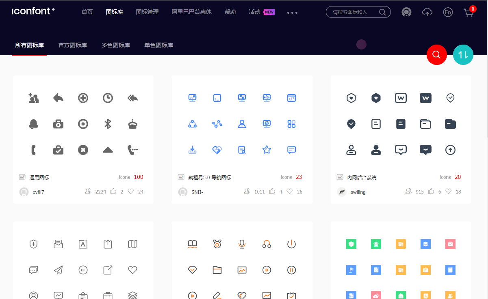
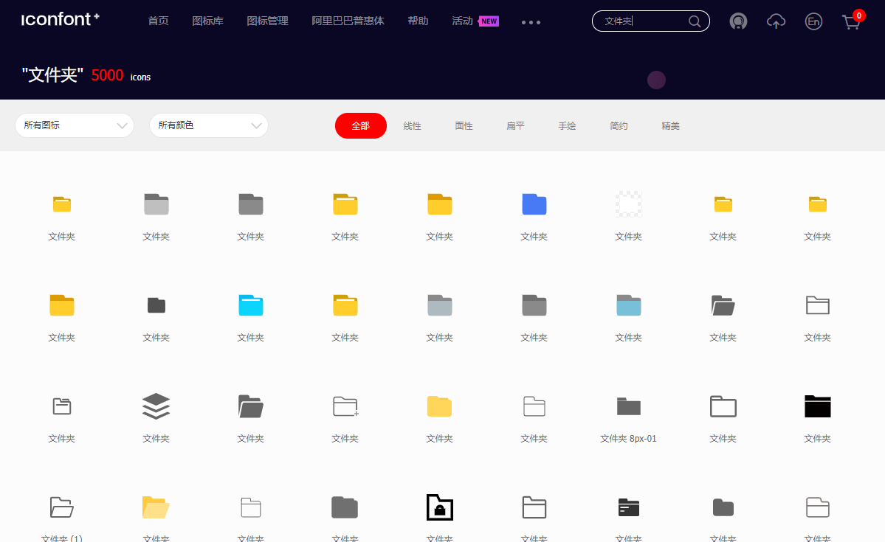
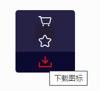
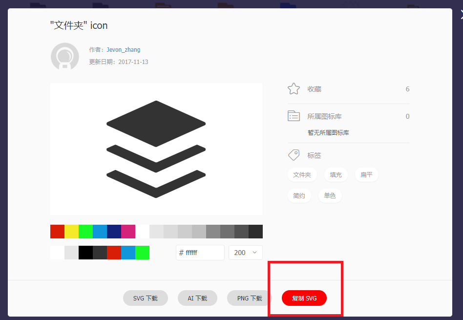
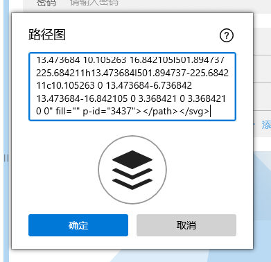
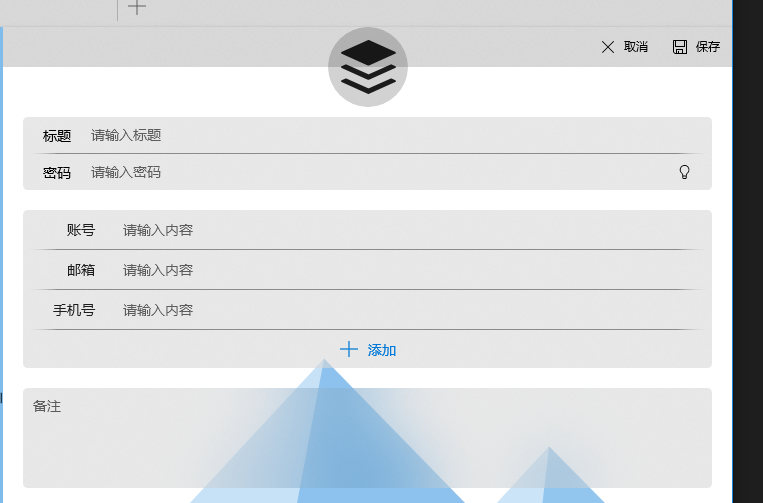

## 简介

目前支持 3 种图标：

1. 图片：不建议使用，由于图片占用空间比较大，会严重影响同步速度和加载速度
2. 字体图标：可满足一般需求，选择范围有限
3. 路径图：推荐使用。选择范围广，图标极其丰富

1 和 2 都很简单，选择就行。

这里介绍如何使用路径图。

## 找图标

推荐网站 [iconfont.cn](https://www.iconfont.cn/collections)

可浏览选择，也可在右上角处搜索，比如搜索“文件夹”可显示如下图片

## 复制内容

找到想要的图标后，鼠标移上去，点“下载”

再点击“复制”

## 软件内使用

在设置路径图的弹窗中，直接粘贴到文本框中即可

再点击确定就设置完成了

