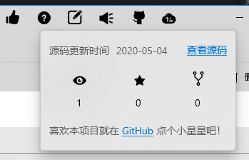

本项目遵循 MIT 开源许可协议，您可以在自己的项目中自由使用部分或全部功能，但需注明[来源](https://github.com/hal-wang/Lavcode)

## 获取代码

### GitHub

- git clone https://github.com/hal-wang/Lavcode.git
- 转至[GitHub](https://github.com/hal-wang/Lavcode)

### 码云

国内用户推荐使用码云，速度更快

- git clone https://gitee.com/hal-wang/Lavcode.git
- 转至[Gitee](https://gitee.com/hal-wang/Lavcode)

## 运行环境

1. Visual Studio 2019（包含 UWP 开发环境）
2. Windows 10 SDK (10.0.18362)

## 跑起来

下载本项目后，使用 vs 2019 打开 `Lavcode.Uwp.sln` 文件，编译并运行。

## 目录结构

```
├── Assets
│   ├── Images
│   │   ├── Visual（UWP中的图标资源）
│   │   ├── *.jpg/png（其他图片）
├── Controls （可复用控件，后面详细介绍）
│   ├── Comment
│   ├── IconControl
│   ├── ...
├── Helpers 帮助类
│   ├── Sqlite（操作Sqlite的帮助类）
│   ├── ...
├── Model （一些Model类）
│   ├── Folder
│   ├── Password
│   ├── ...
├── Resources （样式资源）
│   ├── Colors.xaml
│   ├── ...
├── View （展现内容主要都在这里，后面详细介绍）
│   ├── FolderList
│   ├── PasswordDetail
│   ├── PasswordList
│   ├── ...
├── App（UWP的入口）
├── Global.cs（会被全局调用的静态类）
├── Program.cs（App的入口，包含Main函数，主要在这里实现的多实例应用）
```

::: tip
虽然本项目尽量遵守 MVVM 设计模式，使用了 MVVMLight，但我受 vue 影响，不喜欢严格按照 UWP、WPF 的 MVVM 目录格式，而习惯于将组件模块化放在一起。所以对于 MVVM 初学者，可能会被带偏。**目前我还不知道哪种更好，希望有大佬给解个惑。**
:::

## 整体

主页面如下图所示


主页面主要由以下四部分组成


1. 文件夹列表
2. 密码列表
3. 密码内容，编辑和查看复用同一部分
4. 菜单

这四部分都在 View 文件夹中。

## 各部分的逻辑关系

4 和 123 没什么联系，主要是 123 直接的逻辑。我使用了 MVVMLight 的 Messenger，使各部分处于弱连接状态。下面说几条主要逻辑关系。

### 选中文件夹

选中某个文件夹时，会发出消息

```
Messenger.Default.Send(
  index < FolderItems.Count ? FolderItems[index] : null
  , "FolderSelected"); // index是选中的0基文件夹序号
```

2 和 3 同时注册 Messenger，以监听文件夹选择

```
Messenger.Default.Register<FolderItem>(this, "FolderSelected", FolderSelected);
```

因此选中文件夹时，能够触发以下操作：

1. 在 3 中，会记录选择的文件夹 ID，用于编辑或新建密码。
2. 在 2 中，会根据选中的文件夹，查询该文件夹下的密码，并展现在列表中。

### 选中密码

如果选中密码列表中的一个密码，会发出消息

```
Messenger.Default.Send(passwordItem, "PasswordSelectedChanged");
```

这个`"PasswordSelectedChanged"`消息已被 3 注册，3 接收到后会展现密码详情。
<br>
其实在选中文件夹时，2 也会发送这个消息，但`passwordItem`是空值，3 接收到空消息会清空当前显示，从而实现选中文件夹即清空密码详情部分。

### 保存密码

添加或编辑密码，保存成功后会发出消息

```
Messenger.Default.Send(newPassword, "PasswordAddOrEdited");
```

在 2 中注册了这个消息，收到这个消息会在列表中添加一条记录，此时接收到的密码，已经成功保存在数据库中，因此只需在界面展现即可。

### 密码列表操作密码

在 2 中做以下操作，会生成添加密码的消息通知

- 点下方“添加”
- 点右键菜单的“添加”

  

```
Messenger.Default.Send<object>(null, "AddNewPassword");
```

3 会保存正在编辑的，保存成功后新建一条空内容。

### 密码详情页删除密码

在 3 中删除密码，会生成消息通知

```
Messenger.Default.Send(password.Id, "PasswordDeleted");
```


2 接收到后删除列表中对应的密码

## 文件夹

文件夹使用了`TabView`，重写`TabItemTemplate`

```
        <muxc:TabView Style="{StaticResource TabViewStyle}"
                      Grid.Row="1"
                      MinHeight="40"
                      VerticalAlignment="Top"
                      CanDragTabs="True"
                      TabDragCompleted="{x:Bind Model.DragCompleted}"
                      TabItemsSource="{x:Bind Model.FolderItems}"
                      SelectedIndex="{x:Bind Model.SelectedIndex,Mode=TwoWay}"
                      AddTabButtonClick="{x:Bind Model.HandleAddFolder}">
            <muxc:TabView.TabItemTemplate>
                <DataTemplate>
                    <muxc:TabViewItem Header="{Binding Name}"
                                      IsClosable="False"
                                      Height="40">
                        <muxc:TabViewItem.Template>
                            <ControlTemplate TargetType="muxc:TabViewItem">
                                <!--
                                ...
                                -->
                            </ControlTemplate>
                        </muxc:TabViewItem.Template>
                    </muxc:TabViewItem>
                </DataTemplate>
            </muxc:TabView.TabItemTemplate>
        </muxc:TabView>
```

## 密码列表

密码列表是`ListView` + `Microsoft.Toolkit.Uwp.UI.Controls`中的`Expander`，`Expander`是下方添加、批量编辑。

```
    <Grid>
        <Grid.RowDefinitions>
            <RowDefinition Height="*"/>
            <RowDefinition Height="auto"/>
        </Grid.RowDefinitions>

        <ListView>
        </ListView>
        <controls:Expander Grid.Row="1">
        </controls:Expander>
    </Grid>
```

## 密码详情

这部分就是控件的堆叠，包含大量 View 与 ViewModel 的绑定。键值对部分是`ListView`，具体查看相关代码

## GitHub

所在目录：`View/Git/`

上方菜单点击 GitHub 图标，弹出的内容。



这里的三个图标，都被封装成了 Icon 子组件，在同一目录下。

## Sync

所在目录：`View/Sync/`

同步的操作与界面都在这里，包括备份与恢复的弹窗、历史记录、登录弹窗、密码验证、上传操作、下载操作、合并等


## BackSvg

所在目录：`View/`

验证页面和主页面的背景图，使用的 Path，因此颜色可跟随主题改变

## Commands

所在目录：`Controls/Commands`

顶部的菜单，也就是在[页面整体布局](./part)介绍的 4。这里的每个菜单，都已经写成了组件的形式。此处再封装有三个作用：

1. 设置各菜单图标和提示内容
2. 控制组件加载时机
3. 便于主页面和验证页面复用

## FirstUseDialog

所在目录：`View/`

用户首次使用出现的提示框

## HelpDialog

所在目录：`View/`

“帮助”弹窗

## Rating

所在目录：`View/`

打分与打赏的弹出内容


---

## Comment

所在目录：`Controls/Comment`

获取某个 Issue 下的 Comments，展现为列表。`CommentSource`类实现了`IIncrementalSource`接口的`GetPagedItemsAsync`函数，如果列表过多会延迟加载。

## IconControl

所在目录：`Controls/IconControl/`

应用支持的图标控件，在以下几个地方使用：

1. 文件夹列表中，每个文件夹的图标
2. 密码列表中，每个密码的图标
3. 添加/编辑文件夹时，显示的图标
4. 添加/编辑/查看密码时，显示的图标
5. 移动密码时，文件夹列表图标

目前支持三种图标

1. 路径图（SVG）
2. 图片
3. Segoe MDL2 Assets 字体

## IconSelecter

所在目录：`Controls/IconSelecter/`

图标选择控件，使用了 7.3 的 IconControl。点击即弹出图标选择的 Popup。该控件在以下几个地方使用：

1. 添加/编辑文件夹
2. 添加/编辑密码


## Header

所在目录：`Controls/`

页面的头部，为了统一化各页面的头部显示


## Logo

所在目录：`Controls/`

APP 的 logo，是 Path 形式，可任意控制颜色和大小。在以下几个地方使用：

1. 主页面左上角
2. 出现弹窗时，APP 左上角

## Version

所在目录：`View/`

版本显示，便于验证页和主页面统一显示版本信息

## Auth

所在目录：`View/Auth`

验证页面

## Feedback

所在目录：`View/Feedback`

反馈页面，列表使用了 7.1 的 `Comment`，点“反馈”会跳转的网页，在网页中使用了 GitTalk。也可在 本项目的 [Issues](https://github.com/hal-wang/Lavcode/issues/3) 看到。
这里的反馈列表，就是这条 Issue 中的 Comments

## FolderList

所在目录：`View/FolderList`

密码文件夹

## 未完待续
