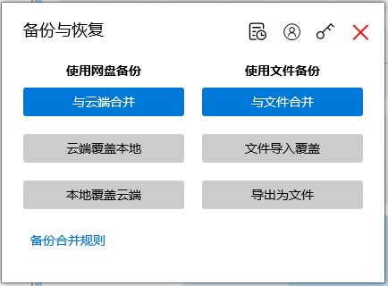
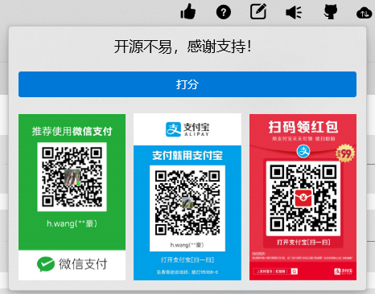

## 介绍

与单独页面相关的组件，在页面所在文件夹中可以找到。比如反馈页面在 `View/Feedback`，反馈页面上方的按钮在 `View/Feedback/Icon`。这些组件后面介绍页面时再说。

**以下组件均位于 View 文件夹中**

## GitHub

GitHub：上方菜单点击 GitHub 图标，弹出的内容。

这里的三个图标，都被封装成了 Icon 子组件，在同一目录下。

## Sync

同步的操作与界面都在这里，包括备份与恢复的弹窗、历史记录、登录弹窗、密码验证、上传操作、下载操作、合并等

## BackSvg

验证页面和主页面的背景图，使用的 Path，因此颜色可跟随主题改变

## Commands

顶部的菜单，也就是在[页面整体布局](./part)介绍的 4。这里的每个菜单，都已经写成了组件的形式。此处再封装有三个作用：

1. 设置各菜单图标和提示内容
2. 控制组件加载时机
3. 便于主页面和验证页面复用

## FirstUseDialog

用户首次使用出现的提示框

## HelpDialog

“帮助”弹窗

## Rating

打分与打赏的弹出内容

