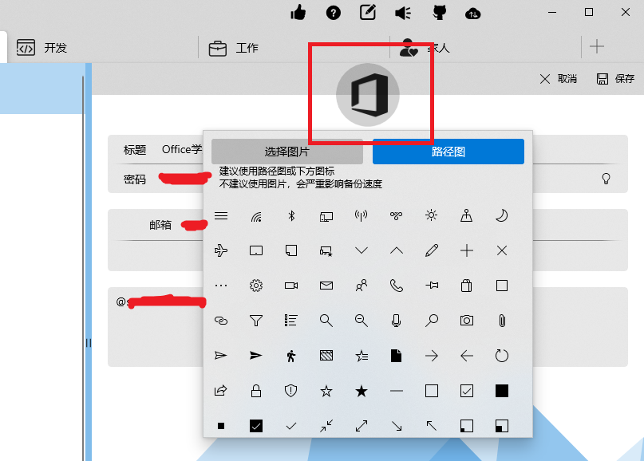

自定义控件会在多处使用，当然你也可以拷贝到你的项目中。

## Comment

获取某个 Issue 下的 Comments，展现为列表。`CommentSource`类实现了`IIncrementalSource`接口的`GetPagedItemsAsync`函数，如果列表过多会延迟加载。

## IconControl

应用支持的图标控件，在以下几个地方使用：

1. 文件夹列表中，每个文件夹的图标
2. 密码列表中，每个密码的图标
3. 添加/编辑文件夹时，显示的图标
4. 添加/编辑/查看密码时，显示的图标
5. 移动密码时，文件夹列表图标

目前支持三种图标

1. 路径图（SVG）
2. 图片
3. Segoe MDL2 Assets 字体

## IconSelecter

图标选择控件，使用了 7.3 的 IconControl。点击即弹出图标选择的 Popup。该控件在以下几个地方使用：

1. 添加/编辑文件夹
2. 添加/编辑密码

## Header

页面的头部，为了统一化各页面的头部显示

## Logo

APP 的 logo，是 Path 形式，可任意控制颜色和大小。在以下几个地方使用：

1. 主页面左上角
2. 出现弹窗时，APP 左上角

## Version

版本显示，便于验证页和主页面统一显示版本信息

## 未完待续
