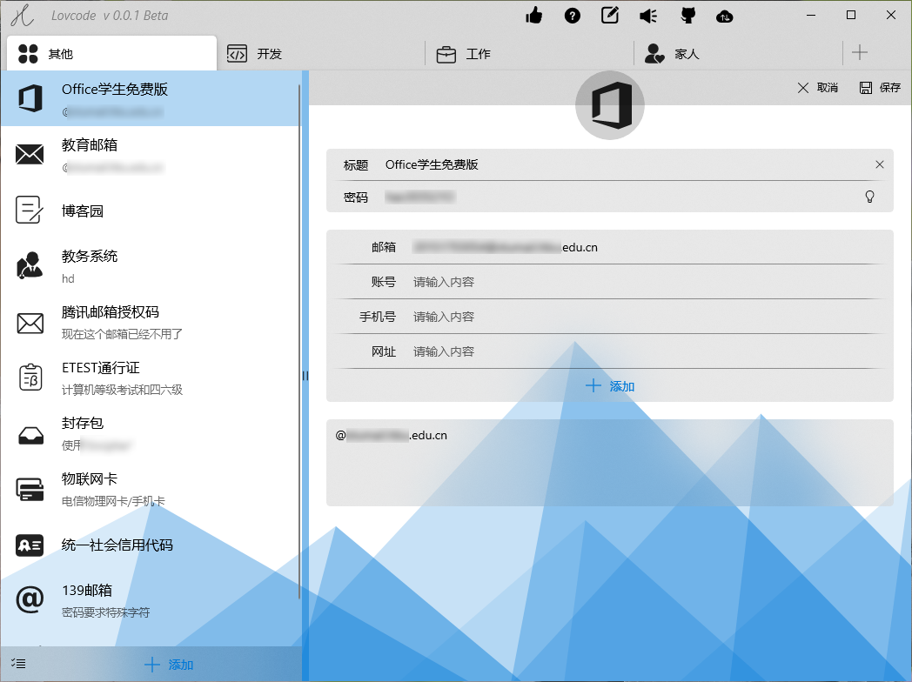
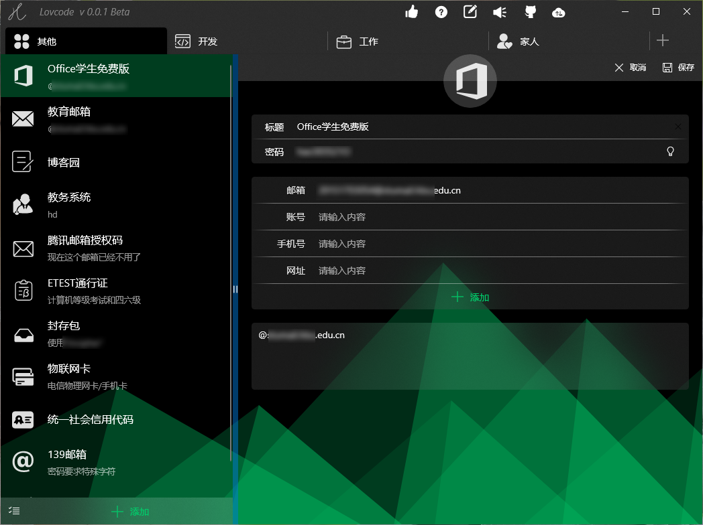
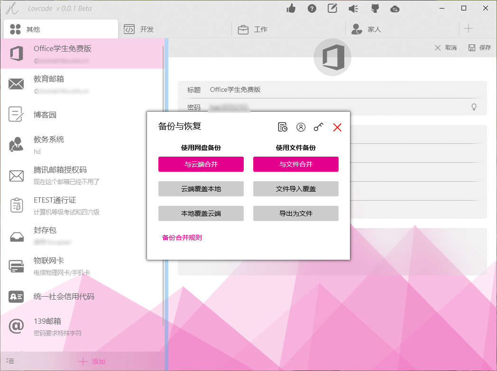
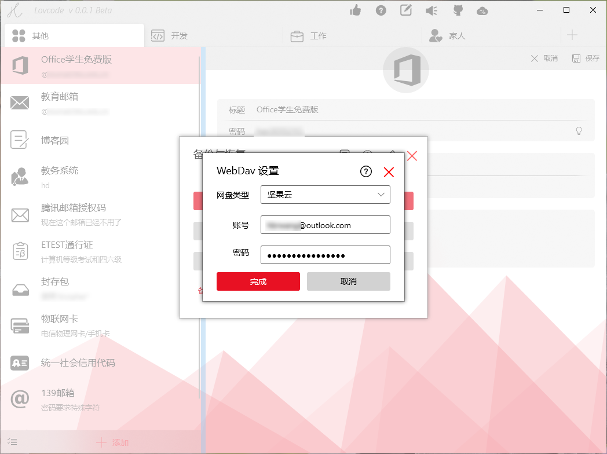

## 指引

- 如果你只是想使用软件，请看 [使用帮助](/pages/usage/start)
- 不管你是开发者大佬来指教，或是小白想学习，请看 [源码说明](/pages/dev/start)

## 为什么选择 Lavcode ？

- 开源保证可信
- 完全免费
- 功能丰富（说了你不一定信，往下看）

## 包含功能

### 先看截图

### 界面

主题色跟随系统，美观多彩的密码管理有木有！！！

### 云同步

可自由选择第三方支持 WebDav 的网盘，同步文件经过你的密码加密，即使把文件发给别人，别人也看不到内容。

加密方式使用 AES256（目前计算机无法破解的一种加密方式）。

同步方式不只是傻傻的覆盖，同时也支持智能合并，再也不怕几台电脑同步来同步去把内容搞丢了。

### 文件同步

不仅可以同步到云，可以把本地文件当作同步介质。导出文件后放在硬盘、U 盘，可随时同步，可随时查看、编辑。

当然，文件也是经过你输入的密码加密的，即使文件被别人弄走，也看不了。

### 绑定文件类型

文件不仅支持更新同步，还能直接打开查看，也能进行修改，修改后也可直接保存更新文件。（可以把一个文件当成一个密码箱。）

### 多窗口、多个密码箱

只能打开一个密码文件怎么能忍?

可同时打开多个文件！还能与软件本身一个窗口一起打开。一个密码文件打开一个窗口，密码再也不乱了。

### 多窗口联动

有多个密码文件想复制密码怎么办？

简单！直接拖拽就能复制。在多选状态下，还能批量拖拽。

把密码从一个密码文件复制到另一个密码文件，或者从密码文件复制到软件，或从软件复制到密码文件，真是如此简单！

### 密码管理

理论上支持无限多的文件夹，每个文件夹支持无限多的密码，每条密码支持无限多的键值内容。

文件夹、密码都可拖拽进行排序。把最经常用的密码拖到前面来吧！

### 文件夹、密码图标

每个文件或密码都支持添加图标，可帮助你快速找到目标。

图标不仅支持字体，还支持图片，更支持强大丰富的 svg 路径图（在 [iconfont](https://www.iconfont.cn/collections) 有海量免费图标）。

### 复杂密码生成器

每个网站都有不同密码不是梦，防止相同密码泄露。

有些内容复杂而难记，比如各种开放 API 的 KEY，各种网站的特殊密钥，Lavcode 都可帮你记下。

## 免费图什么？

当然是图你的小星星了，喜欢本软件就[给个 Star 吧](https://github.com/hbrwang/Lavcode)。

如果可以的话，也希望能收到[捐赠](/pages/donate)。
