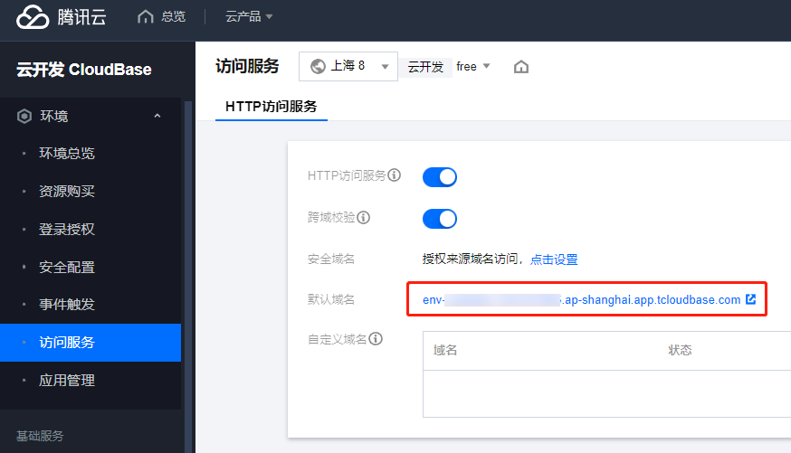

# 云接口

> **不想看介绍的，就直接转到后面 “部署接口” 部分**

Lavcode 支持通过接口的方式存取数据

在选择 “数据存储位置” 界面，选择云接口

输入接口地址和密码即可使用

## 后端接口方案

Lavcode 没有提供直接用的接口，因为大多数人都不愿意将密码存储到别人那里，因此你需要自行部署

源码提供两种方案实现后端接口。对于复杂需求，也可以仿照这两种方案实现自定义方案

1. 方案 1

[cloudbase](https://www.cloudbase.net/) + nodejs + [ipare](https://ipare.org)

源码目录 `src/lavcode-node`

此方案使用比较简单，适合零开发经验的用户，稍微有些开发经验就更好了

2. 方案 2

.NET6 + Asp + Sql Server

源码目录 `Lavcode.Asp`

此方案使用起来稍复杂，需要一定的开发基础

## 部署接口

此部分同样适用于零开发基础的普通用户，每个步骤都有图片示例

使用源码提供的 `src/lavcode-node` 快速部署接口至腾讯云 CloudBase

按以下步骤进行

1. 一键部署

[](https://console.cloud.tencent.com/tcb/env/index?action=CreateAndDeployCloudBaseProject&appUrl=https%3A%2F%2Fgithub.com%2Fhal-wang%2FLavcode&branch=main&workDir=src/lavcode-node)

2. 设置环境变量

设置环境变量步骤如下

(1) 在腾讯云 CloudBase 选择 “我的应用”，点击 `Lavcode` 右侧的 “管理”


(2) 点击编辑按钮，以打开编辑开关


(3) 点击 “新建环境变量” 按钮，添加环境变量 `SECRET_KEY`，值作为云接口密码，然后点 “保存并部署”，等待部署完毕。请尽量设置复杂密码并保管好。


3. 查看域名并连接

(1) 点击左侧菜单 “环境” -> “访问服务”，查看默认域名。也可以添加自定义域名（如果了解域名，建议添加，不加也没影响，_等于废话_）



(2) 在 Lavcode 客户端，存储方式选择云接口，地址为 `https://域名/v1`，密码为前面的环境变量设置的密码 `SECRET_KEY`

如 `https://env-yourenvid-123456789.ap-shanghai.app.tcloudbase.com/v1`


## lavcode-node 介绍

lavcode-node 使用了 nodejs 框架 [ipare](https://ipare.org)，按 Restful 规范实现接口

接口的默认页面是 `swagger`，同样是由 [ipare](https://ipare.org) 自动生成，你可以通过修改源码的方式隐藏 `swagger`

### 本地运行

你也可以选择本地运行 `lavcode-node`

fork 并 clone 项目后，在 `src/lavcode-node` 目录下新增 `.env.local` 文件，内如如下

```
SECRET_KEY=云接口密码
ENV_ID=CloudBase 环境Id
TENCENT_SECRET_KEY=腾讯云 SecretKey
TENCENT_SECRET_ID=腾讯云 SecretId
```

`SecretKey` 和 `SecretId` 的获取参考 <https://cloud.tencent.com/developer/article/1385239>

先运行命令

```sh
npm install
```

然后用 vscode 打开 `src/lavcode-node` 目录，按 F5 即可启动调试

或执行命令

```sh
npm start
```

### 部署

可以本地部署，也可以使用 `GitHub Actions` 部署

#### 本地部署

与前面 `本地运行` 部分创建了 `.env.local` 文件类似，但只用确保包含下面内容

```
SECRET_KEY=云接口密码
ENV_ID=CloudBase 环境Id
```

然后在 `src/lavcode-node` 目录，运行下面命令

```sh
npm install

npx tcb login
npx tcb framework deploy --mode local
```

#### 使用 `GitHub Actions` 部署

1. 设置 GitHub Secrets

Fork 仓库后，设置 GitHub Secrets，添加如下 Secrets

- NODE_ENV_ID: CloudBase 环境 Id
- NODE_SECRET_KEY: 云接口密码
- TENCENT_SECRET_ID: 腾讯云 SecretId
- TENCENT_SECRET_KEY: 腾讯云 SecretKey


`SecretKey` 和 `SecretId` 的获取参考 <https://cloud.tencent.com/developer/article/1385239>

2. 修改脚本

修改源码文件 `.github/workflows/publish-node.yml`

删除此行：`if: github.repository == 'hal-wang/Lavcode'`

3. 提交代码

上面操作完成后，每次提交代码，都会自动部署

## Lavcode.Asp 介绍

Lavcode.Asp 用 C# 语言开发，使用了 Asp.Net Core 框架，按 Restful 规范实现接口

数据库使用 Sql Server + EF，可以很方便的切换数据库，如 MySQL 或 Sqlite

接口的默认页面是 `swagger`，你可以通过修改源码的方式隐藏 `swagger`

### 本地运行

在 `Lavcode.Asp` 文件夹中，创建文件 `appsettings.local.json`，内容如

```json
{
  "SecretKey": "your_secret_key",
  "ConnectionStrings": {
    "MSSQL": "Server=127.0.0.1;Database=Lavcode;uid=sa;Password=H;Encrypt=True;TrustServerCertificate=True;"
  }
}
```

- `SecretKey` 为云接口密码
- `ConnectionStrings.MSSQL` 为数据库连接字符串，一般修改地址和端口即可

无需手动创建数据库，数据库会在首次运行时自动创建

使用 vs 2022 或更新版本打开 `Lavcode.sln`，启动项目选择 `Lavcode.Asp`，按下 F5 即可开始调试

### 部署

与其他 Asp.NET Core 项目部署方式相同

可以部署到 `IIS` / `Docker`/ `Apache` 等

部署时别忘记修改 `appsettings.json` 文件中的 `SecretKey` 和 `ConnectionStrings.MSSQL`

## 安全性

云接口使用 [jwt](https://jwt.io/) 来保证接口不会被非法调用

## 开发接口

你也可以参考源码提供的两种后端方案，自己开发后端接口，能更灵活的更换语言框架和数据库
