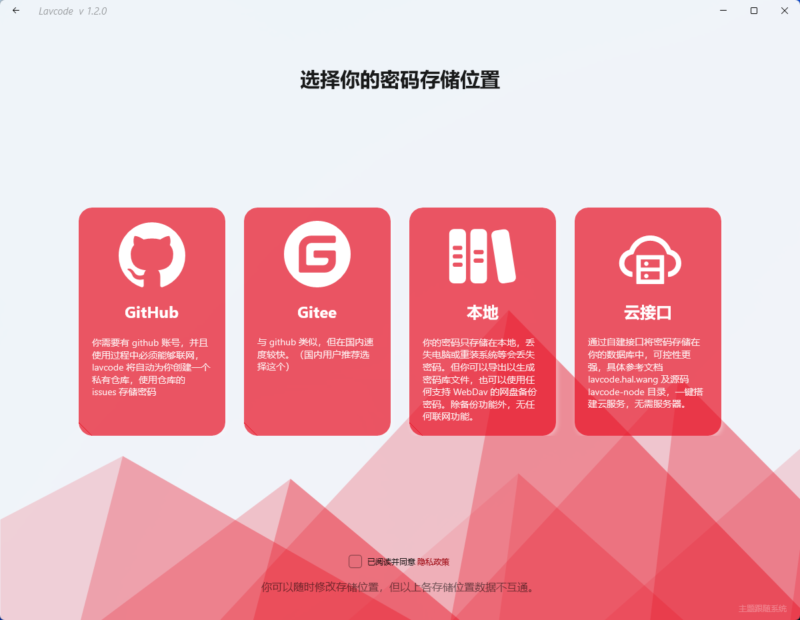

# 快速开始

## 下载安装

`Lavcode` 发布在 `Win10/11` 应用商店 Microsoft Store

- 你可以在应用商店内搜索 `Lavcode` 并下载安装
- 也可以点击链接跳转：<https://www.microsoft.com/store/apps/9N3N7R34ZJDC>

## 存储位置

首次打开软件，会让你选择存储位置，根据描述选择即可

## 引导

首次打开软件，会有使用教程

跟着教程走一遍一般就会使用了

## 界面

主题色跟随系统，美观多彩的密码管理有木有！！！

上几张截图

