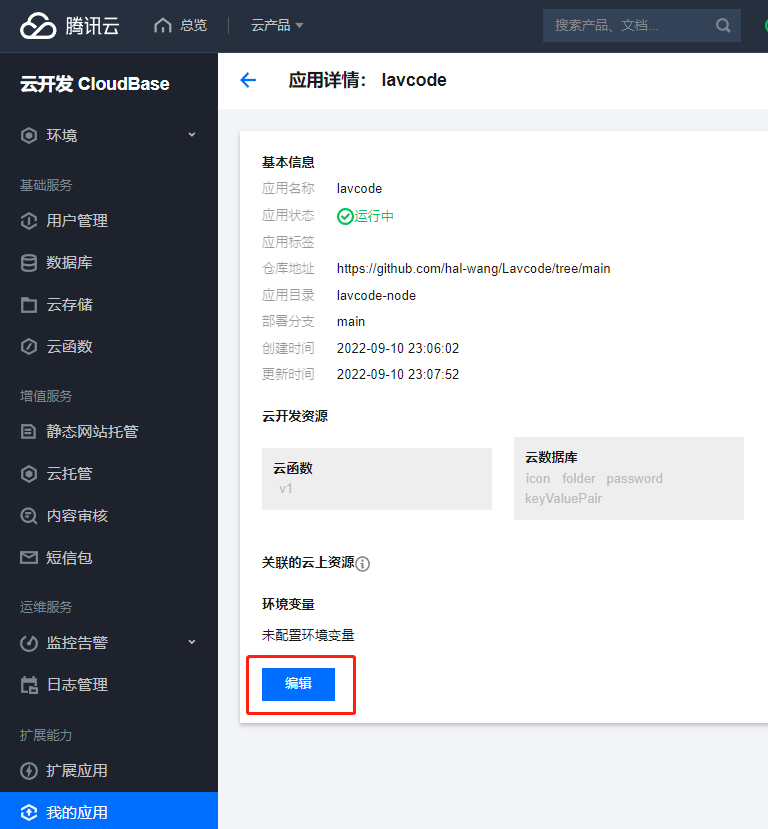
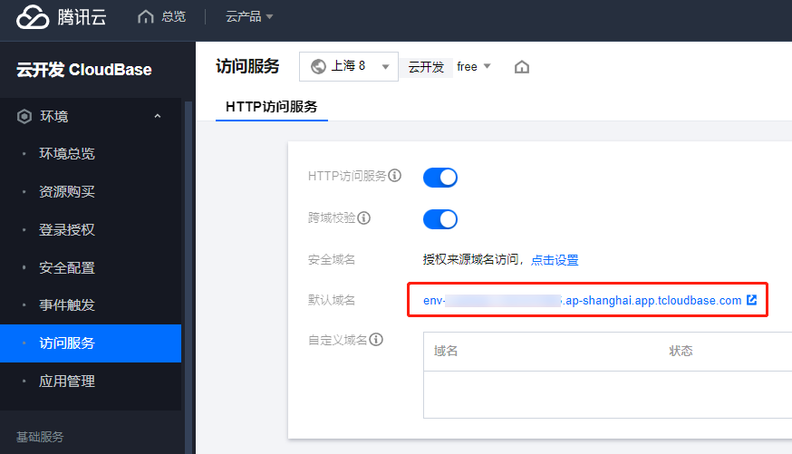
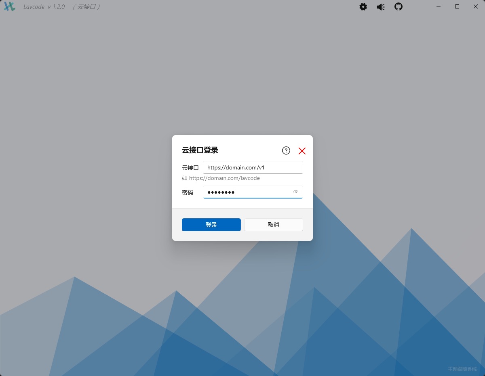

# 云接口

Lavcode 支持通过接口的方式存取数据

在选择 “数据存储位置” 界面，选择云接口

输入接口地址和密码即可使用

本教程使用源码提供的 `lavcode-node` 快速部署接口

## 部署接口

Lavcode 没有提供直接用的接口，因为大多数人都不愿意将密码存储到别人那里，因此你需要自行部署

在源码 `lavcode-node` 文件夹中，提供了 `nodejs` + 腾讯云 `CloudBase` 的方式部署云接口

你需要按以下步骤进行

1. 一键部署

[](https://console.cloud.tencent.com/tcb/env/index?action=CreateAndDeployCloudBaseProject&appUrl=https%3A%2F%2Fgithub.com%2Fhal-wang%2FLavcode&branch=main&workDir=lavcode-node)

2. 设置环境

添加环境变量 `SECRET_KEY`，作为云接口的密码，请尽量设置复杂密码并保管好

部署后在 “环境” -> “访问服务” 可以查看域名

设置环境变量步骤如下

(1) 选择 “我的应用”，点击 `Lavcode` 右侧的 “管理”


(2) 点击编辑按钮，以打开编辑开关



(3) 点击 “新建环境变量” 按钮，输入键值对，然后点 “保存并部署”，等待部署完毕


3. 查看域名并连接

(1) 点击左侧菜单 “环境” -> “访问服务”，查看默认域名，也可以添加自定义域名



(2) 在 Lavcode 客户端，存储方式选择云接口，地址为 `https://域名/v1`，密码为前面的环境变量设置的密码

如 `https://env-yourenvid-123456789.ap-shanghai.app.tcloudbase.com/v1`



## lavcode-node 介绍

lavcode-node 使用了 nodejs 框架 [ipare](https://ipare.org)，按 Restful 规范实现接口

接口的默认页面是 `swagger`，同样是由 [ipare](https://ipare.org) 自动生成，你可以通过修改源码的方式隐藏 `swagger`

## 本地运行

你也可以选择本地运行 `lavcode-node`

fork 并 clone 项目后，在 `lavcode-node` 目录下新增 `.env.local` 文件，内如如下

```
SECRET_KEY=云接口密码
ENV_ID=CloudBase 环境Id
TENCENT_SECRET_KEY=腾讯云 SecretKey
TENCENT_SECRET_ID=腾讯云 SecretId
```

`SecretKey` 和 `SecretId` 的获取参考 <https://cloud.tencent.com/developer/article/1385239>

用 vscode 打开 `lavcode-node` 目录，按 F5 即可启动调试

或执行命令 `npm start`

## 安全性

云接口使用 [jwt](https://jwt.io/) 来保证接口不会被非法调用

## 开发接口

你也可以参考源码 `lavcode-node` 自己开发后端接口，能更灵活的更换语言框架和数据库
